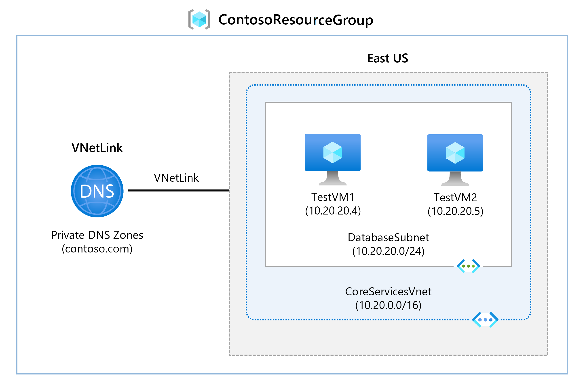
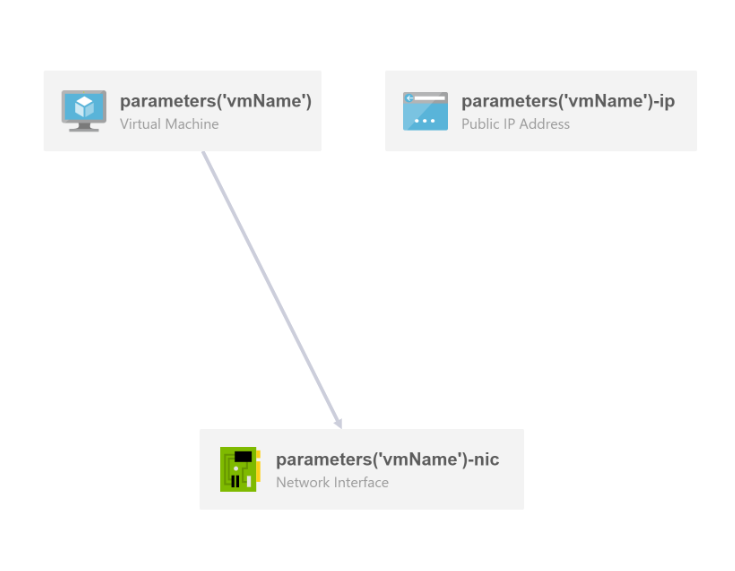

# Description
**This script automates the Interactive lab simulation which is part of the ["Configure Azure DNS"](https://learn.microsoft.com/en-us/training/modules/configure-azure-dns/8a-simulation-domain-names) -learning module**

## Scenario requirements

**In this unit, you'll configure DNS name resolution and create a private DNS zone. You'll link the VNets for registration and resolution, and then create two virtual machines and test the configuration.**

## Architecture



## BICEP/ARM templates used for creating the VMs



## Solution

> Task 1: Create a private DNS Zone.
```powershell
# some text
```
> Task 2: Link subnet for auto registration.
```powershell
# some text

```
> Task 3: Create Virtual Machines to test the configuration.
```powershell
# some text
```
> Task 4: Verify records are present in the DNS zone.

## Contributing

Pull requests are welcome. For major changes, please open an issue first
to discuss what you would like to change.

Please make sure to update tests as appropriate.

## License
[MIT](https://choosealicense.com/licenses/mit/)