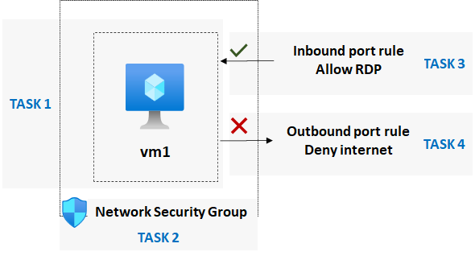
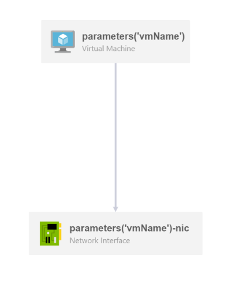

# Description
**This script automates the Interactive lab simulation which is part of the ["Configure network security groups"](https://learn.microsoft.com/en-us/training/modules/configure-network-security-groups/) -learning module**
## Scenario requirements

**Your organization wants to ensure that access to virtual machines is restricted. As the Azure Administrator, you need to:**

* Create and configure network security groups.

* Associate network security groups to virtual machines.

* Deny and allow access to the virtual machines by using network security groups.

## Architecture



## ARM template creates a simple windows wm



## Solution

> Task 1: Create a virtual machine to test network security
```powershell
# Define initial variables:

[string]$virtualMachineRG = Read-Host -Prompt "Enter the name of the Resource Group"
[string]$location = Read-Host -Prompt "Enter the location of the Resource Group"
[string]$nsgName = Read-Host -Prompt "Enter the name of the Network Security Group"
[string]$vmName = Read-Host -Prompt "Enter the name of the Virtual Machine"
[string]$adminUsername = Read-Host -Prompt "Enter the admin username"
[string]$Password = openssl rand -base64 32
[securestring]$adminPassword = ConvertTo-SecureString -String $Password -AsPlainText -Force
[string]$templateFile = "$PSScriptRoot\Templates\simpleWinWM\simpleWinWm.json"

# Create the RG:
New-AzResourceGroup -Name $rg -Location $location

# Use the 'newVnet.psm1' module to create a new vnet
New-Vnet

# Use the 'newSubnet.psm1' module to configure subnets
New-Subnet

# Deploy VMs from ARM template
New-AzResourceGroupDeployment -ResourceGroupName $virtualMachineRG `
        -location $location `
        -vmName $vmName `
        -vnetNAme $vnetName `
        -subnetName $subnetName `
        -adminUsername $adminUsername `
        -adminPassword $adminPassword `
        -TemplateFile $templateFile

# Note: password will be written to a file. See script file info to update the location.
```
> Task 2: Create a network security group, and associate the group with the virtual machine.
```powershell
New-AzNetworkSecurityGroup -ResourceGroupName $rg -Name $nsg -Location $location

$nsg = Get-AzNetworkSecurityGroup -ResourceGroupName $virtualMachineRG -Name $nsgName
$nicName = Get-AzNetworkInterface -ResourceGroupName $rg | Select-Object -ExpandProperty Name
$nic = Get-AzNetworkInterface -ResourceGroupName $rg -Name $nicName
$nic.NetworkSecurityGroup = $nsg
$nic | Set-AzNetworkInterface
```
> Task 3: Configure an inbound security port rule to allow RDP.
```powershell
$nsg | Add-AzNetworkSecurityRuleConfig -Name "Allow-RDP" `
    -Description "Allow RDP" `
    -Access Allow `
    -Protocol Tcp `
    -Direction Inbound `
    -Priority 300 `
    -SourceAddressPrefix * `
    -SourcePortRange * `
    -DestinationAddressPrefix * `
    -DestinationPortRange 3389 `
    | Set-AzNetworkSecurityGroup
```
> Task 4: Configure an outbound security port rule to deny internet access
```powershell
$nsg | Add-AzNetworkSecurityRuleConfig -Name "Deny-Internet" `
    -Description "Deny Internet" `
    -Access Deny `
    -Protocol Tcp `
    -Direction Outbound `
    -Priority 4000 `
    -SourceAddressPrefix * `
    -SourcePortRange * `
    -DestinationAddressPrefix Internet `
    -DestinationPortRange * `
    | Set-AzNetworkSecurityGroup
```
## Contributing

Pull requests are welcome. For major changes, please open an issue first
to discuss what you would like to change.

Please make sure to update tests as appropriate.

## License
[MIT](https://choosealicense.com/licenses/mit/)